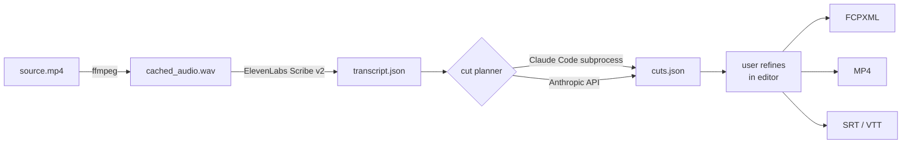

<div align="center">

# katto

**Transcript-driven rough-cut editor for long-form video.**

Transcribe, AI-plan cuts, refine, export to FCP / DaVinci Resolve / Premiere.

[](https://github.com/Konadu-Akwasi-Akuoko/katto/actions/workflows/ci.yml)
[](LICENSE)
[](https://www.rust-lang.org/)
[](https://v2.tauri.app/)
[](https://react.dev/)
[](https://www.typescriptlang.org/)
[](#prerequisites)
[](CONTRIBUTING.md)
[](CODE_OF_CONDUCT.md)

[](https://github.com/Konadu-Akwasi-Akuoko/katto/stargazers)
[](https://github.com/Konadu-Akwasi-Akuoko/katto/issues)
[](https://github.com/Konadu-Akwasi-Akuoko/katto/commits/main)

</div>

> **Status:** early development. Working name `katto` (placeholder, may change). Not yet released. ⚠️ Expect breaking changes until `v0.1`.

---

## What it does

`katto` turns raw long-form footage into a usable rough cut:

1. **Transcribe** the audio with [ElevenLabs Scribe v2](https://elevenlabs.io/speech-to-text)
2. **Plan cuts** with an LLM — fillers, retakes, false starts, long silences
3. **Refine** the cuts in a transcript-primary editor
4. **Export** to FCPXML 1.11 (FCP / Resolve / Premiere), MP4, and SRT/VTT captions

It does the boring 80% of cutting and hands a clean starting point to your real NLE.

> _Demo gif coming once the editor UI is interactive — watch this space._

## Why

Most video editors spend hours scrubbing through long-form footage to remove ums, retakes, and dead air before the actual creative edit can begin. `katto` automates that first pass and gives you back a project file you can open in the tool you already use.

## Pipeline



## Architecture

Two artifacts in one repo:

| Crate          | Role                                                                                                       |
| -------------- | ---------------------------------------------------------------------------------------------------------- |
| `katto-engine` | Pure-Rust library + CLI. Owns the pipeline: import, transcribe, plan, render, export.                     |
| `katto-app`    | Tauri 2 desktop app. React + TypeScript frontend, Rust backend wrapping the engine.                       |

A detailed design document is maintained alongside the code; it will be published in `docs/` once it stabilizes.

## Export targets

| Format           | Opens in                                          | Notes                                    |
| ---------------- | ------------------------------------------------- | ---------------------------------------- |
| **FCPXML 1.11**  | Final Cut Pro · DaVinci Resolve · Premiere Pro   | Frame-accurate, rational time invariant  |
| **MP4 (H.264)**  | Anything                                          | ffmpeg concat over kept ranges           |
| **SRT / VTT**    | YouTube · Vimeo · most players                    | Re-timestamped to the kept-only timeline |

## Getting started

> Build instructions will land once the workspace split is in place. For now this repo contains a fresh Tauri scaffold.

### Prerequisites

- [Rust](https://www.rust-lang.org/tools/install) (stable)
- [Bun](https://bun.sh/)
- `ffmpeg` and `ffprobe` on `PATH`
- An [ElevenLabs](https://elevenlabs.io/) API key
- Either [Claude Code](https://docs.claude.com/en/docs/claude-code) installed (preferred) or an [Anthropic](https://console.anthropic.com/) API key
- Tauri 2 [system prerequisites](https://v2.tauri.app/start/prerequisites/) for your platform

### Run the app (dev)

```bash
bun install
bun run tauri dev
```

## Roadmap

- [ ] Workspace split: `katto-engine` (lib + CLI) + `katto-app` (Tauri)
- [ ] `import` — ffmpeg audio extraction + project bundle skeleton
- [ ] `transcribe` — ElevenLabs Scribe v2 integration
- [ ] `plan` — cut-decider via subprocess Claude Code or direct Anthropic HTTP
- [ ] `render` — ffmpeg concat MP4 export
- [ ] `export` — FCPXML 1.11 + SRT / VTT
- [ ] Editor UI — transcript pane, video preview, timeline
- [ ] First `v0.1` release

## Contributing

Contributions are very welcome. See [CONTRIBUTING.md](CONTRIBUTING.md) for setup, code style, and the PR process. By participating, you agree to the [Code of Conduct](CODE_OF_CONDUCT.md).

Looking for a starting point? Check out [`good first issue`](https://github.com/Konadu-Akwasi-Akuoko/katto/issues?q=is%3Aissue+is%3Aopen+label%3A%22good+first+issue%22) and [`help wanted`](https://github.com/Konadu-Akwasi-Akuoko/katto/issues?q=is%3Aissue+is%3Aopen+label%3A%22help+wanted%22) issues.

## Security

Found a vulnerability? Please report it privately — see [SECURITY.md](SECURITY.md).

## Acknowledgements

- [Kiru](https://kiru.app) — primary commercial reference for the transcript-driven editing UX
- [Descript](https://www.descript.com/) — original transcript-driven editor (informed the category)
- [Tauri](https://v2.tauri.app/) — the cross-platform desktop framework
- [ElevenLabs](https://elevenlabs.io/) — Scribe v2 speech-to-text
- [Anthropic](https://www.anthropic.com/) — Claude, the brain behind cut planning

## Star history

<a href="https://www.star-history.com/#Konadu-Akwasi-Akuoko/katto&Date">
  <picture>
    <source media="(prefers-color-scheme: dark)" srcset="https://api.star-history.com/svg?repos=Konadu-Akwasi-Akuoko/katto&type=Date&theme=dark" />
    <source media="(prefers-color-scheme: light)" srcset="https://api.star-history.com/svg?repos=Konadu-Akwasi-Akuoko/katto&type=Date" />
    
  </picture>
</a>

## License

[MIT](LICENSE) © 2026 [Konadu Akwasi Akuoko](https://github.com/Konadu-Akwasi-Akuoko)
